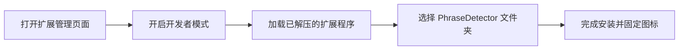

# PhraseDetector 产品使用与配置说明文档

**PhraseDetector** 是一款专为语言学习者与深度阅读者打造的智能浏览器插件。借助大语言模型（LLM）的上下文理解能力，它能够从网页长文中精准提炼出高价值词汇、地道短语与高级句式结构，并支持划词即搜、智能朗读、AI 故事串联记忆及一键同步到 Anki。

---

## 目录
1. [产品核心功能](#1-产品核心功能)
2. [插件安装步骤](#2-插件安装步骤)
3. [大模型（LLM）配置方法](#3-大模型llm配置方法)
   - [方案 A：本地模型（Ollama）及 CORS 代理配置](#方案-a本地模型ollama-及-cors-代理配置-免费--隐私安全)
   - [方案 B：在线大模型（OpenAI 兼容接口）](#方案-b在线大模型openai-兼容接口)
4. [本地代理（proxy.js）与 Node.js 安装说明](#4-本地代理proxyjs与-nodejs-安装说明)
5. [进阶功能配置（TTS 与 Anki 同步）](#5-进阶功能配置)
6. [常见问题排查（FAQ）](#6-常见问题排查faq)

---

## 1. 产品核心功能

* **全文智能扫描（Scan Page）**：长文本分段流式分析，瞬间提炼全篇语言点。
* **三维语言点分类体系**：
  * 💎 **Power Word（核心/亮点词）**：生动有力的核心词汇，自动标注国际音标/拼音注音及精准释义。
  * 🔗 **Phrase（实用短语）**：地道俚语、习惯用语与固定搭配。
  * 🏗️ **Structure（句式结构）**：提炼高级写作/论述框架（如对比、递进、转折模板），助力表达升级。
* **网页划词即搜**：选中文本右键一键获取上下文释义并自动添加彩色高亮。
* **AI 故事记忆（Generate Story）**：将生词本中收藏的短语，一键由大模型串联创作成生动的生活小短文。
* **Anki 无缝同步**：内置定制精美卡片样式，一键将生词推送到本地 Anki 牌组。

---

## 2. 插件安装步骤

适用于 **Google Chrome**、**Microsoft Edge** 以及其他 Chromium 内核浏览器（Brave、Arc 等）。



### 详细操作步骤：

1. **打开扩展程序管理界面**：
   * 在 Chrome 地址栏输入并访问：`chrome://extensions/`
   * （Edge 浏览器输入：`edge://extensions/`）
2. **开启开发者模式**：
   * 在页面右上角，找到并打开 **「开发者模式 (Developer Mode)」** 开关。
3. **加载插件**：
   * 点击左上角出现的 **「加载已解压的扩展程序 (Load unpacked)」** 按钮。
   * 在弹出的文件选择框中，选中 `PhraseDetector` 的项目根目录文件夹并确认。
4. **固定插件图标**：
   * 点击浏览器右上角拼图形状的「扩展程序」图标，找到 **PhraseDetector** 并点击图钉 📌 将其固定到工具栏。

---

## 3. 大模型（LLM）配置方法

安装完成后，点击插件图标底部的 **设置齿轮 ⚙️**（或右键插件图标选择「选项」），进入 **Settings** 页面进行大模型配置。

---

### 方案 A：本地模型（Ollama）及 CORS 代理配置 — *免费 · 隐私安全*

如果你本地运行了 Ollama（支持 Llama 3、Qwen 2.5、DeepSeek-R1 等）：

| 配置项 | 推荐填写值 | 说明 |
| :--- | :--- | :--- |
| **LLM Provider** | `Ollama (Local)` | 选择本地 Ollama |
| **API URL** | `http://127.0.0.1:11435/api/generate` *(推荐使用代理端口)*<br>或 `http://127.0.0.1:11434/api/generate` | 跨域时使用 `11435` 代理端口 |
| **API Key** | *留空即可* | 本地无需密钥 |
| **Model Name** | `llama3:latest` 或 `qwen2.5:7b` | 你在本地下载的模型名称 |
| **Explanation Language** | `Chinese (中文)` | 释义目标语言 |

> **⚠️ 为什么推荐使用 11435 代理端口？**  
> 浏览器的安全机制会拦截直接向 `11434` 端口发送的跨域请求（CORS）。运行项目内置的 `proxy.js`（工作在 `11435` 端口）可以完美解决跨域问题。具体启动步骤见下方第 4 节。

---

### 方案 B：主流在线大模型及自定义接口（自动填充）

> **💡 说明**：使用在线大模型**完全不需要安装 Node.js 或运行代理脚本**。在设置页面选择对应的 Provider 即可**自动填充 API URL 与默认 Model Name**，只需填入您的 API Key 即可。

#### 1. 支持的预设 Provider：

| Provider | 预设 API URL | 默认模型推荐 | 说明 |
| :--- | :--- | :--- | :--- |
| **DeepSeek (官方)** | `https://api.deepseek.com/v1/chat/completions` | `deepseek-chat` | 官方大模型，高性价比 |
| **SiliconFlow (硅基流动)** | `https://api.siliconflow.cn/v1/chat/completions` | `deepseek-ai/DeepSeek-V3` | 聚合算力平台，支持多种开源大模型 |
| **OpenRouter** | `https://openrouter.ai/api/v1/chat/completions` | `deepseek/deepseek-chat` | 全球多模型统一路由网关 |
| **OpenAI (ChatGPT)** | `https://api.openai.com/v1/chat/completions` | `gpt-4o-mini` 或 `gpt-4o` | 官方 ChatGPT 接口 |
| **通义千问 (DashScope)** | `https://dashscope.aliyuncs.com/compatible-mode/v1/chat/completions` | `qwen-plus` | 阿里百炼兼容接口 |
| **Kimi (Moonshot)** | `https://api.moonshot.cn/v1/chat/completions` | `moonshot-v1-8k` | 月之暗面 Kimi |
| **智谱清言 (GLM)** | `https://open.bigmodel.cn/api/paas/v4/chat/completions` | `glm-4-flash` | 智谱 AI 开放平台 |
| **Custom (OpenAI Compatible)** | *自定义输入* | *自定义输入* | 适配 OneAPI、NewAPI、LocalAI、Cloudflare 等自建代理 |

#### 2. 保存与连接测试：
1. 下拉选择目标 Provider，插件会自动填入对应官方 **API URL** 与 **推荐模型**。
2. 填入您的 **API Key**（以 `sk-...` 开头）。
3. 点击 **「Test Connection」** 按钮，显示绿色的 **「Connection Successful!」** 即代表配置成功。
4. 点击 **「Save Settings」** 保存设置。

---

## 4. 本地代理（proxy.js）与 Node.js 安装说明

> **仅在使用本地 Ollama 且遇到 CORS 跨域拦截时需要此步骤**。使用在线 API 用户可直接跳过。

### 4.1 检查/安装 Node.js 环境

`proxy.js` 依赖 Node.js 运行时。

1. **检查是否已安装 Node.js**：
   打开终端输入：
   ```bash
   node -v
   ```
   * 若输出类似 `v18.x.x` 或 `v20.x.x`，说明已安装，直接进入下一步。
   * 若提示 `command not found: node`，请前往 [Node.js 官方网站](https://nodejs.org/) 下载 **LTS 版本** 安装包完成安装。

### 4.2 运行 proxy.js 代理服务

1. **进入插件目录并安装依赖**：
   ```bash
   # 进入项目文件夹
   cd /Users/vincenthan/Documents/备课/AI工具/PhraseDetector

   # 安装必要依赖（express, cors, node-fetch）
   npm install
   ```

2. **启动代理服务**：
   ```bash
   node proxy.js
   # 或者
   npm start
   ```

   控制台出现以下输出即表示代理启动成功：
   ```text
   🚀 CORS 代理服务器运行在 http://127.0.0.1:11435
   📝 请求将转发到 Ollama (http://127.0.0.1:11434)
   ✅ 现在可以在 Chrome 扩展中使用 http://127.0.0.1:11435/api/generate
   ```

3. **（可选）后台常驻运行**：
   如果不想一直开着终端窗口，可以使用后台运行命令：
   ```bash
   # 后台常驻运行
   nohup node proxy.js > proxy.log 2>&1 &

   # 如需停止后台代理
   pkill -f "node proxy.js"
   ```

---

## 5. 进阶功能配置

### ① 语音朗读（TTS）配置
* **Web Speech API（默认）**：无需任何配置，直接调用系统自带的拟真语音引擎。
* **ElevenLabs（高保真拟真人声）**：
  1. 在 Settings 中将 **TTS Provider** 切换为 `ElevenLabs`。
  2. 填入你的 `ElevenLabs API Key`。
  3. 添加 Voice 名称与对应的 `Voice ID`（如 Rachel、Adam 等），保存即可在插件中体验逼真人声。

### ② Anki 同步配置（AnkiConnect）
1. 确保电脑已安装并打开 **Anki** 客户端。
2. 安装 Anki 插件 **AnkiConnect**（插件代码：`2055492159`）。
3. 确保 AnkiConnect 监听 `http://127.0.0.1:8765`，PhraseDetector 将会自动识别你的卡牌牌组并一键推送定制卡片。

---

## 6. 常见问题排查（FAQ）

* **Q: 点击 Scan Page 提示 `API 错误 401` 或 `403`？**
  * **A**: 
    * 401：API Key 填写有误或已过期，请检查密钥是否带有空格或遗漏。
    * 403：检查当前 API 账户是否有足够余额或模型调用权限；如果使用 Ollama，请确认 Provider 是否误选为 Online。
* **Q: 本地 Ollama 点击测试提示 `Failed to fetch` 或网络错误？**
  * **A**: 
    1. 请确认本地 Ollama 客户端已正常启动。
    2. 运行 `node proxy.js` 启动代理，并在插件设置中将 URL 端口改为 `11435`（`http://127.0.0.1:11435/api/generate`）。
* **Q: 使用在线大模型需要安装 Node.js 或运行 `proxy.js` 吗？**
  * **A**: 不需要。在线 API 由浏览器直接发起 HTTPS 请求，免安装任何运行环境。
* **Q: 网页划词没有弹出解释？**
  * **A**: 刷新当前网页使 Content Script 生效；部分浏览器内部页面（如 `chrome://` 系列）不允许运行扩展程序。
